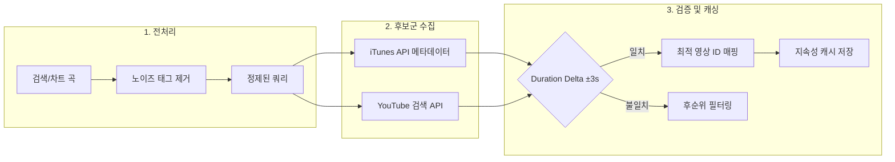
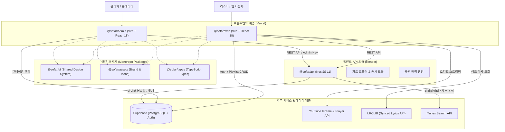
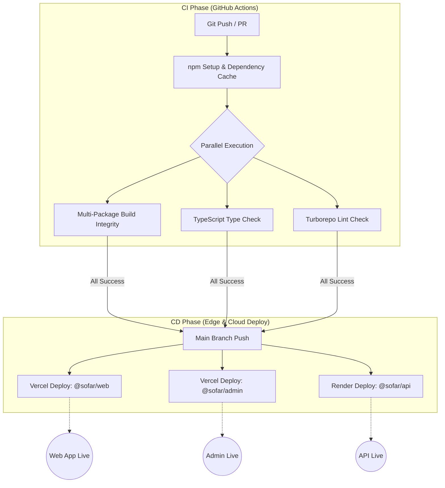

<div align="center">
    

[버그 제보](https://github.com/team-croni/sofar/issues) · [기능 요청](https://github.com/team-croni/sofar/issues)

**"유튜브 기반으로 광고 없이 즐기는 스마트 웹 오디오 스트리밍"**

YouTube 음원을 기반으로 광고 없이 누구나 무료로 음악을 감상하고, 정교한 싱크 가사와 함께 몰입할 수 있는 웹 스트리밍 플랫폼입니다.

·

·

·

</div>

### 핵심 기술 스택
| 분류         | 기술                         | 설명                                              |
| ------------ | ---------------------------- | ------------------------------------------------- |
| 프론트엔드   | React 18 & Vite 5            | 최신 웹 기술 기반의 고성능 오디오 플레이어 및 관리자 대시보드 |
| 백엔드 API   | NestJS 11 & TypeScript       | 음원 메타데이터 정제, 차트 크롤링 및 큐레이션 관리 |
| 데이터베이스 | Supabase (PostgreSQL)        | RLS(Row Level Security) 기반 데이터 보안 및 영구 스토리지 |
| 음원 & 미디어| YouTube IFrame & LRCLIB      | YouTube IFrame 규격 준수 스트리밍 및 실시간 동기화 가사 연동 |
| 모노레포     | Turborepo & npm Workspaces   | 워크스페이스 간 공통 패키지 공유 및 고속 빌드 캐싱 |
| 배포         | Vercel & Render              | 분산 아키텍처 기반의 안정적인 글로벌 서비스 배포  |

### 핵심 기능
| 기능                     | 설명                                                                   |
| ------------------------ | ---------------------------------------------------------------------- |
| 하이브리드 음원 매칭 알고리즘 | iTunes 메타데이터와 YouTube 검색 결과를 결합한 재생시간(±3s) 검증 로직 |
| 실시간 싱크 가사 시스템   | LRCLIB 연동, 가사 클릭 탐색(Seek) 및 밀리초 단위 실시간 오프셋 조절    |
| 비파괴적 오디오 대기열   | 재생 중인 컨텍스트를 유지하면서 유연하게 곡을 추가하고 순서를 편집하는 큐 |
| 게스트 데이터 마이그레이션 | 로컬 스토리지에 저장된 플레이리스트를 로그인 시 클라우드로 자동 무손실 병합 |
| 관리자 큐레이션 스튜디오 | 실시간 통계 KPI 모니터링, 음원 불일치 리포트 관리 및 드래그앤드롭 수동 매칭 |

---

**sofar**는 YouTube 기반으로 광고 없이 누구나 무료로 음악을 감상할 수 있는 웹 스트리밍 플랫폼입니다.  
유튜브 영상 중 커버나 라이브가 아닌 **실제 원곡을 정확하게 찾아내는 자체 음원 매칭 로직**을 구현하였으며, 이를 바탕으로 **실시간 싱크 가사 연동 및 완성도 높은 웹 오디오 플레이어 환경**을 제공합니다.

기존 웹 스트리밍 도구들의 한계를 극복하고자 다음과 같은 목표를 설정했습니다:

- **정확한 원곡 매칭**: 커버/라이브/짜깁기 영상을 배제하고 타겟 곡의 오리지널 음원 매칭 정확도 극대화
- **정교한 싱크 가사**: 음악 재생 시점에 완벽히 동기화되는 가사 하이라이팅 및 클릭 탐색(Seek) 지원
- **비파괴적 음악 재생 경험**: 차트나 앨범 탐색 중에도 재생 흐름을 끊지 않는 안정적인 글로벌 오디오 컨텍스트
- **운영 자동화 및 품질 관리**: 사용자 불일치 피드백 루프와 관리자 큐레이션 도구를 통한 지속적인 데이터 품질 보장

---

### 2.1. 원곡을 찾아내는 하이브리드 음원 매칭
사용자가 검색한 음악이나 차트 수록곡에 대해 커버/리액션 영상이 아닌 실제 원곡 음원을 정확하게 찾아 재생할 수 있도록 지능형 매칭 파이프라인을 구축했습니다.

#### 매칭 방식
1. **메타데이터 정제 (Sanitization)**: 곡명과 아티스트명에서 방송사 태그, `[MV]`, `(Live)`, `feat.` 등 불필요한 노이즈를 정규화합니다.
2. **복합 쿼리 수집**: iTunes Search API의 표준 메타데이터와 YouTube 키리스 검색을 조합하여 최적의 후보군을 수집합니다.
3. **재생시간(Duration Delta) 검증**: 공식 음원 길이와 후보 영상 길이 간의 편차(±3s)를 비교 분석하여 최적의 원곡 영상을 필터링합니다.

#### 알고리즘: Duration Delta Matching Pipeline



#### 사용자 피드백 기반 자가 보정 (Feedback Loop)
- **불일치 리포트**: 재생 중 '원곡과 다름' 클릭 시 백엔드에서 해당 영상 ID에 페널티가 부여되어 즉시 차순위 대체 음원으로 전환됩니다.
- **관리자 큐레이션 연동**: 누적된 불일치 피드백은 관리자 대시보드에 리포트되어 드래그앤드롭 수동 매칭으로 영구 보정됩니다.

### 2.2. 밀리초 단위 정밀 싱크 가사 시스템 (Synced Lyrics)
LRCLIB 오픈 API와 연동하여 밀리초 단위로 동기화되는 실시간 가사 인터페이스를 제공합니다.

#### 가사 동기화 기능
- **실시간 하이라이팅**: 현재 오디오 재생 시점에 맞춰 부드럽게 가사 활성 행이 전환되고 자동 스크롤됩니다.
- **가사 클릭 탐색 (Seek to Line)**: 특정 가사 라인을 클릭하면 해당 타임스탬프로 오디오가 즉각 점프합니다.
- **오프셋 미세 조절**: 라이브/스페셜 클립의 인트로 길이 차이를 극복하기 위해 `±0.5s`, `±5.0s` 단위로 가사 싱크를 사용자가 직접 보정할 수 있습니다.

### 2.3. 끊김 없는 재생을 위한 비파괴적 대기열 및 컨텍스트
React Context 기반의 글로벌 오디오 관리 시스템을 통해 페이지 이동 및 탐색 중에도 음악이 끊김 없이 재생됩니다.

#### 동시성 및 상태 제어
- **Non-Destructive Queue**: 차트나 앨범 전체 재생 중에도 개별 곡을 '대기열 추가'하거나 '다음에 재생'할 수 있어 기존 재생 목록 컨텍스트를 보존합니다.
- **YouTube IFrame API 가드레일**: 플랫폼 이용약관 및 IFrame 정책을 준수하면서 백그라운드 오디오 조작 상태를 매끄럽게 제어합니다.
- **로컬 스토리지 & 클라우드 병합**: 비로그인 상태의 재생목록과 즐겨찾기 데이터를 Google OAuth 로그인 시 Supabase 데이터베이스에 무손실 자동 병합합니다.

---

본 시스템은 Turborepo 기반의 모노레포로 구성되어 있으며, 메인 웹 애플리케이션이 Vercel에, 관리자 대시보드가 Vercel에, 백엔드 API 서버가 Render에 배포되는 분산형 아키텍처를 따릅니다.



### 3.1. 주요 배포 구성
- **메인 웹 애플리케이션 (`@sofar/web`)**: [Vercel](https://vercel.com/)에 배포되어 빠른 글로벌 엣지 응답 속도와 안정적인 정적 에셋 서빙 제공
- **관리자 대시보드 (`@sofar/admin`)**: [Vercel](https://vercel.com/)을 통해 안전하게 격리 배포된 큐레이션 및 운영 센터
- **백엔드 API 서버 (`@sofar/api`)**: [Render](https://render.com/)에 배포된 고성능 NestJS 서버로 실시간 차트 스크래핑, 음원 검색 및 캐싱 처리
- **데이터베이스 & 인증**: [Supabase](https://supabase.com/)의 PostgreSQL과 Supabase Auth (Google OAuth 2.0), RLS(Row Level Security)를 통한 강력한 데이터 보안
- **외부 미디어 & 데이터 연동**: YouTube IFrame API (음원 스트리밍), LRCLIB (실시간 싱크 가사), iTunes Search API (글로벌 음원 메타데이터)

### 3.2. 주요 데이터 흐름
- **음원 스트리밍**: `User` ➔ `트랙 선택` ➔ `YouTube ID 로딩 & Duration 검증` ➔ `IFrame Player 렌더링` ➔ `오디오 재생`
- **가사 동기화**: `User` ➔ `Track Info` ➔ `LRCLIB API 호출` ➔ `LRC 타임스탬프 파싱` ➔ `재생 시점별 자동 롤링 & 하이라이팅`
- **음원 불일치 자가 보정**: `User (원곡과 다름 클릭)` ➔ `NestJS API 불일치 접수` ➔ `페널티 부여 & 차순위 음원 자동 스왑` ➔ `관리자 피드백 리스트 적재`
- **게스트 데이터 병합**: `Guest LocalStorage` ➔ `Google OAuth 로그인` ➔ `Supabase RLS 마이그레이션 함수 실행` ➔ `사용자 계정 통합 완료`

### 3.3. 인프라 선택 이유
각 서비스를 선택한 기술적 배경은 다음과 같습니다:

- **Turborepo & npm Workspaces**: UI 디자인 시스템, 타입, 에셋을 단일 레포에서 공유하여 코드 중복을 제거하고 빌드 캐싱으로 개발 생산성 극대화
- **NestJS & TypeScript**: 모듈형 아키텍처를 통해 차트 크롤링, 유튜브 검색, 관리자 기능 간의 결합도를 낮추고 유지보수성 향상
- **Supabase**: Serverless PostgreSQL과 세밀한 행 수준 보안(RLS) 정책을 통해 멀티 유저 환경에서 안전한 데이터 관리 지원
- **Vercel & Render**: 글로벌 CDN 기반의 초고속 프론트엔드 서빙과 안정적인 백엔드 웹 서비스 호스팅을 결합한 분산 아키텍처 구현

---

### 4.1. 정교한 오디오 플레이어 & 사용자 경험
- **비디오 ID 오토 매핑**: 재생 중인 트랙의 비디오 ID로부터 공식 고화질 썸네일을 자동 추출하여 앨범 아트워크 구성
- **Vinyl 커버 애니메이션**: 재생 상태에 따라 부드럽게 회전 및 정지하는 턴테이블 애니메이션
- **유튜브 정책 가드레일**: IFrame API 규격 준수 미니 플레이어 상시 렌더링 및 재생 제한 영상 자동 스킵/토스트 알림

### 4.2. 관리자 큐레이션 스튜디오 (`@sofar/admin`)
- **실시간 통계 KPI**: 총 등록 트랙, 큐레이션 수, 유저 플레이리스트 및 가입 리스너 지표 모니터링
- **음원 불일치 리포트 관리**: 사용자 피드백을 곡 단위로 통합 보존 및 상태(미해결/해결) 관리
- **드래그앤드롭 수동 매칭**: 오른쪽 사이드바 유튜브 검색 패널을 통해 큐레이션 수록곡에 최적의 음원을 드래그앤드롭으로 즉시 연동

---

본 프로젝트는 모노레포 환경에서 GitHub Actions와 Turborepo 캐싱을 결합하여 코드 품질 검증부터 배포까지 자동화된 파이프라인을 구축했습니다.

### 파이프라인 흐름도


### 주요 자동화 특징
- **Turborepo 원격 빌드 캐싱**: 변경되지 않은 패키지의 빌드 및 린트 과정을 캐시 처리하여 배포 시간을 대폭 단축합니다.
- **엄격한 타입 및 린트 검증**: PR 단계에서 프론트엔드와 백엔드의 정적 분석을 병렬 수행하여 런타임 오류를 사전에 차단합니다.
- **분산 배포 파이프라인**: 프론트엔드(Vercel)와 백엔드(Render)가 독립적으로 배포되어 서비스 가용성을 극대화합니다.

---

```text
sofar/
├── apps/
│   ├── web/               # 메인 리스너 웹 애플리케이션 (@sofar/web)
│   │   ├── src/
│   │   │   ├── components/# 플레이어, 가사 뷰어, 홈 피드, 검색 컴포넌트
│   │   │   ├── contexts/  # AudioContext, AuthContext, FavoriteContext
│   │   │   ├── hooks/     # useNowPlaying, useLyrics, useHomeFeed 등
│   │   │   └── utils/     # youtube.js, itunes.js, lrcParser.js 등
│   │   └── .env.example
│   ├── admin/             # 관리자 종합 대시보드 및 큐레이션 에디터 (@sofar/admin)
│   │   ├── src/
│   │   │   ├── pages/     # DashboardPage, CurationsPage, UsersPage
│   │   │   ├── components/# AdminHeader, AdminRightSidebar, KPI Cards
│   │   │   └── context/   # AdminContext, ToastContext
│   │   └── .env.example
│   └── api/               # NestJS 백엔드 API 서버 (@sofar/api)
│       ├── src/
│       │   ├── chart/     # 차트 크롤링, 유튜브 검색, 지속성 캐시
│       │   ├── admin/     # 큐레이션 및 사용자 관리 백엔드 서비스
│       │   └── email/     # 인증 및 알림 서비스
│       └── .env.example
├── packages/
│   ├── ui/                # 공통 디자인 시스템 UI 컴포넌트 (@sofar/ui)
│   ├── assets/            # SVG 아이콘 및 브랜드 로고 에셋 (@sofar/assets)
│   └── types/             # 공통 TypeScript 타입 정의 (@sofar/types)
├── docs/                  # 프로젝트 상세 기획 및 기술 명세서 모음
├── PRD.md                 # 마스터 제품 요구사항 정의서
├── TDD.md                 # 마스터 기술 설계 및 개발 가이드
├── LICENSE                # 저작권 및 사용권 정책
├── CONTRIBUTING.md        # 코드 기여 가이드
├── SECURITY.md            # 보안 취약점 보고 정책
├── turbo.json             # Turborepo 파이프라인 설정
└── package.json           # 루트 워크스페이스 정의
```

---

### Frontend
- **Framework**: React 18, Vite 5
- **Language**: JavaScript (ESNext) / TypeScript
- **Styling**: Vanilla CSS, Modern Design System
- **State Management**: React Context, React Query
- **Routing**: React Router (Admin)
- **Icons**: Lucide React

### Backend
- **Framework**: NestJS 11
- **Language**: TypeScript
- **Scraping & HTTP**: Axios, Cheerio
- **Database**: PostgreSQL (Supabase)
- **Authentication**: Supabase Auth (Google OAuth 2.0, RLS)

### Media & External APIs
- **Audio Streaming**: YouTube IFrame Player API
- **Synced Lyrics**: LRCLIB API
- **Metadata**: iTunes Search API

### DevOps & Infrastructure
- **Monorepo**: Turborepo, npm Workspaces
- **Deployment**: Vercel (Web, Admin), Render (API)
- **Version Control & CI/CD**: Git, GitHub Actions

---

<div align="center">

© 2026 [Croni](https://github.com/team-croni). All rights reserved.

</div>

