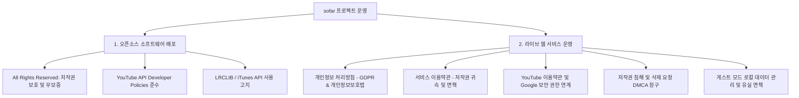

# Legal, Privacy Policy & Terms of Service Guide (법적 고지, 개인정보 처리방침 및 이용약관 가이드)

- **Date**: 2026-08-19
- **Version**: v2.1.0
- **Author**: sofar team

본 문서는 `sofar` 프로젝트를 GitHub 오픈소스로 배포하거나, 실제 독립 도메인에서 웹 서비스로 호스팅하여 운영하고자 하는 개발자 및 운영자를 위한 **법적 고지(Legal Disclaimer), 개인정보 처리방침(Privacy Policy), 서비스 이용약관(Terms of Service), YouTube API 서비스 정책 준수 가이드**입니다.

---

## 1. 법적 체계 개요 (Legal Architecture Overview)



---

## 2. YouTube API Developer Policies 준수 사항

`sofar`는 YouTube의 공식 **IFrame Player API**를 기반으로 오디오를 스트리밍합니다. Google 및 YouTube의 개발자 정책을 위반하지 않기 위해 다음 핵심 수칙을 반드시 준수해야 합니다:

1. **미니 플레이어 상시 렌더링 (`F-POLI-01`)**:
   - YouTube 비디오 스트림을 0px로 숨기거나 투명하게 가리는 행위는 YouTube API 서비스 약관 위반입니다.
   - 본 프로젝트의 `MiniPlayer.jsx`는 최소 규격(240px * 135px)을 준수하여 상시 렌더링되도록 구현되어 있습니다.
2. **미디어 스트림 자체 호스팅/다운로드 금지**:
   - 음원이나 비디오 바이너리를 로컬 서버에 다운로드, 추출(Rip), 재배포하지 않습니다.
3. **YouTube 약관 및 Google 계정 권한 철회 고지 필수**:
   - 서비스 내에 YouTube 이용약관(`https://www.youtube.com/t/terms`) 및 Google 개인정보처리방침(`https://www.google.com/policies/privacy`) 링크를 제공해야 합니다.
   - Google 보안 설정 페이지(`https://security.google.com/settings/security/permissions`)를 통해 사용자가 본 서비스의 계정 권한을 언제든 철회할 수 있음을 명시해야 합니다.

---

## 3. [표준 템플릿] 개인정보 처리방침 (Privacy Policy Template)

> 실제 서비스 런칭 시 아래 템플릿의 `[회사명/서비스명]`, `[담당자 이메일]` 등을 적절히 수정하여 사용하십시오.

```markdown
# [서비스명] 개인정보 처리방침 (Privacy Policy)

**시행일자: 2026년 8월 19일 (v2.1.0)**

[서비스명](이하 "회사" 또는 "서비스")은 이용자의 개인정보를 중요시하며, 「개인정보 보호법」 및 관련 법령을 준수하고 있습니다.

### 1. 개인정보의 처리 목적
1. **회원 관리**: 소셜/이메일 계정 기반 본인 식별, 중복 가입 방지, 비인가 부정 이용 방지
2. **서비스 제공**: 개인 맞춤형 플레이리스트 생성 및 다기기 클라우드 동기화, 커스텀 프로필 아바타 저장, 사용자 맞춤 가사 오프셋 보관
3. **서비스 품질 향상**: 음원 불일치 피드백 정제, 검색/큐레이션 추천 투표 결과 집계 및 어뷰징 방지

### 2. 처리하는 개인정보 항목 및 수집 방법
- **소셜(Google OAuth) 로그인 시**: 이용자 고유 식별자(UUID), 이메일 주소, 기본 프로필 이름(닉네임), 프로필 이미지 URL
- **이메일 회원가입 시**: 이메일 주소, 암호화된 비밀번호(단방향 해시), 닉네임
- **프로필 커스텀 시 (선택)**: 사용자가 직접 업로드한 커스텀 프로필 이미지
- **게스트 모드 및 서비스 이용 시 자동 생성 정보**: 브라우저 로컬 저장소(Local Storage)에 보관되는 임시 플레이리스트 데이터, 가사 싱크 오프셋 보정 수치, 볼륨/테마 설정값, 어뷰징 방지용 게스트 세션 식별자

> ※ 회사는 이용자의 구글 계정 비밀번호나 민감한 금융 정보를 일체 수집하거나 저장하지 않습니다.

### 3. 개인정보의 보유 및 이용 기간, 파기 절차
1. 회원의 개인정보는 **회원 탈퇴 시까지** 보유 및 이용됩니다.
2. 회원이 계정 삭제(회원 탈퇴)를 요청하는 경우, 데이터베이스 내의 사용자 계정 정보, 업로드한 프로필 이미지, 생성된 플레이리스트 및 수록곡 데이터는 지체 없이 **즉시 영구 파기(CASCADE 삭제)**됩니다.
3. 비회원(게스트) 모드의 로컬 데이터는 이용자가 브라우저 캐시를 삭제하거나 서비스 내 '게스트 데이터 초기화' 기능을 실행할 때 즉시 브라우저에서 영구 소멸됩니다.

### 4. 개인정보의 제3자 제공 및 처리 위탁
회사는 이용자의 사전 동의 없이 개인정보를 제3자에게 무단 제공하지 않습니다. 다만, 안정적인 서비스 인프라 제공을 위해 다음과 같이 위탁 및 연계하고 있습니다:
- **수탁자**: Supabase Inc. (클라우드 데이터베이스 호스팅, 암호화 세션 관리, 스토리지 파일 저장)
- **연계 서비스**: Google LLC (YouTube IFrame Player API 스트리밍 및 Google OAuth 인증)

### 5. 이용자 및 법정대리인의 권리와 행사 방법
1. 이용자는 언제든지 본인의 개인정보 열람, 닉네임/프로필 수정, 회원 탈퇴를 통한 삭제를 요구할 수 있습니다.
2. Google 계정 연동 권한은 [Google 보안 설정 페이지](https://security.google.com/settings/security/permissions)에서 언제든지 직접 철회하실 수 있습니다.
3. 기타 권리 행사는 아래 개인정보 보호책임자 이메일로 요청하시면 지체 없이 조치됩니다.

### 6. 쿠키(Cookie) 및 로컬 스토리지(Local Storage)의 운용
1. 서비스는 로그인 세션 유지, 게스트 모드 임시 보관함, 음량 설정 등을 위해 브라우저 Local Storage를 사용합니다.
2. 이용자는 웹 브라우저 설정을 통해 데이터 저장을 거부하거나 삭제할 수 있습니다.

### 7. 개인정보의 안전성 확보 조치
- 비밀번호 단방향 암호화, HTTPS(SSL/TLS) 통신 암호화, 데이터베이스 RLS(Row Level Security) 접근 격리 적용

### 8. 개인정보 보호책임자 및 문의처
- **담당 부서 / 담당자**: [서비스 운영팀]
- **문의 이메일**: [support@yourdomain.com]
```

---

## 4. [표준 템플릿] 서비스 이용약관 (Terms of Service Template)

```markdown
# [서비스명] 서비스 이용약관 (Terms of Service)

**시행일자: 2026년 8월 19일 (v2.1.0)**

**제1조 (목적)**
본 약관은 [서비스명](이하 "서비스")이 제공하는 웹 오디오 플레이어, 큐레이션, 플레이리스트 관리 및 관련 제반 서비스의 이용과 관련하여 회사와 이용자 간의 권리, 의무 및 책임사항을 규정함을 목적으로 합니다.

**제2조 (외부 서비스 약관 및 정책의 준용)**
1. 본 서비스는 Google LLC의 YouTube IFrame Player API를 활용하여 미디어를 스트리밍 및 렌더링합니다.
2. 이용자는 본 서비스를 이용함으로써 [YouTube 서비스 약관](https://www.youtube.com/t/terms) 및 [Google 개인정보 보호정책](https://www.google.com/policies/privacy)에 동의한 것으로 간주됩니다.
3. 이용자는 [Google 보안 설정 페이지](https://security.google.com/settings/security/permissions)를 통해 서비스에 부여한 권한을 언제든 철회할 수 있습니다.

**제3조 (지식재산권의 귀속 및 콘텐츠 책임)**
1. 서비스 내에서 스트리밍되는 모든 음악, 동영상, 앨범 아트워크, 가사 등의 저작권은 해당 저작물의 원저작자 및 YouTube 콘텐츠 크리에이터에게 귀속됩니다.
2. 본 서비스는 오디오 스트림이나 영상을 서버에 다운로드, 복제, 재판매하지 않으며 공개된 임베드 링크를 통해 렌더링하는 플레이어 인터페이스만을 제공합니다.

**제4조 (이용자의 의무 및 금지행위)**
이용자는 다음 각 호의 행위를 하여서는 안 됩니다:
1. 서비스의 정상적인 운영을 방해하는 자동화된 스크립트, 크롤러, 봇의 무단 사용
2. YouTube 및 외부 API 제공자의 기술적 보호조치를 무력화하거나 우회하는 행위
3. 피드백 및 추천 투표 시스템 어뷰징(다중 투표 조작, 허위 제보 등)
4. 타인의 계정 정보를 도용하거나 부정하게 사용하는 행위

**제5조 (게스트 모드 및 데이터 관리)**
1. 비회원 게스트 모드로 생성된 데이터는 브라우저 Local Storage에만 보관됩니다.
2. 캐시 삭제나 기기 변경으로 인한 게스트 데이터 유실에 대해 회사는 복구 책임을 지지 않습니다.

**제6조 (사용자 피드백 및 기여 데이터)**
이용자가 서비스 품질 개선을 위해 제출한 음원 불일치 제보, 가사 싱크 보정값 등은 서비스 품질 향상을 위해 비독점적으로 활용될 수 있습니다.

**제7조 (면책 조항)**
1. 회사는 YouTube 등 외부 플랫폼의 서비스 장애, 정책 변경, 영상의 비공개 또는 삭제로 인해 서비스 제공이 일시적으로 중단되거나 음원 재생이 불가능해진 경우에 대해 책임을 지지 않습니다.
2. 회사는 천재지변, 불가항력적 네트워크 장애 등으로 인해 서비스를 제공할 수 없는 경우 면책됩니다.

**제8조 (저작권 침해 신고 및 삭제 요청, DMCA)**
저작권자 또는 권리자는 서비스 내에 표시되는 콘텐츠가 본인의 저작권을 침해한다고 판단되는 경우 [support@yourdomain.com]으로 침해 사실 및 삭제 요청을 접수할 수 있으며, 서비스는 확인 즉시 해당 콘텐츠의 노출을 차단합니다.

**제9조 (준거법 및 관할 법원)**
본 약관에 관한 분쟁은 대한민국 법률을 준거법으로 하며, 민사소송법상의 관할법원에 제기합니다.
```

---

## 5. 오픈소스 리포지토리 체크리스트 (Summary Checklist)

- [x] **루트 LICENSE 생성**: All Rights Reserved 저작권 보호 및 포트폴리오 열람 허용 라이선스 탑재 완료
- [x] **README.md 내 Disclaimer 기재**: YouTube API 약관 및 저작권 귀속 공지 완료
- [x] **환경변수 분리**: `.env.example` 템플릿만 커밋하고 실제 비밀 키는 `.gitignore`로 완벽 차단
- [x] **보안 취약점 신고 채널 제공**: `SECURITY.md` 탑재 완료
- [x] **실제 배포자를 위한 가이드 제공**: 본 `docs/legal-privacy-policy-guide.md` 제공

