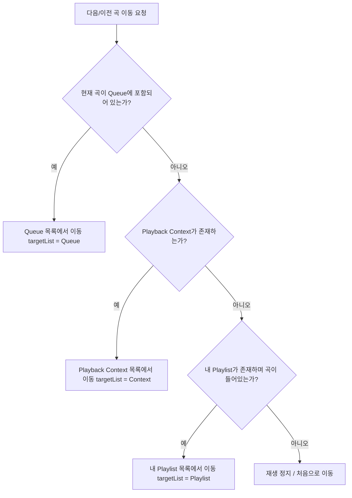

# Audio Player Playback System & Queue Specification

**Date**: 2026-08-07  
**Version**: v1.0.0  

이 문서는 `sofar` 웹 애플리케이션의 오디오 플레이어 상태 관리(대기열 vs 백그라운드 플레이리스트 컨텍스트) 아키텍처 및 동작 규칙을 정의합니다.

---

## 1. 개요 (Overview)

Sofar 오디오 플레이어는 **대기열(Queue)**과 **백그라운드 플레이리스트 컨텍스트(Playback Context)**를 분리하여 관리합니다. 사용자가 차트 곡을 재생할 때 대기열이 통째로 덮어씌워지는 문제를 방지하고, 직관적인 플레이리스트/대기열 UX를 유지하기 위해 두 구조의 역할과 우선순위를 엄격히 정의합니다.

---

## 2. 재생 트랙 관리 구별 (State Classification)

| 구분 | 대기열 (Queue) | 백그라운드 플레이리스트 컨텍스트 (Playback Context) |
| :--- | :--- | :--- |
| **상태 관리** | `queue` | `playbackContext` |
| **등록 주체** | 사용자의 명시적 **[대기열 추가]** 클릭 시 (`ListPlus`, `+`) | **[재생]**, **[전체 재생 ▶]**, **[셔플 재생 🔀]** 클릭 시 |
| **목적** | 사용자가 즉시/다음에 듣고 싶어 직접 구성한 유연한 우선 재생 목록 | 현재 재생 중인 앨범, 차트, 플레이리스트 등의 백그라운드 맥락 목록 |
| **영향 범위** | `setQueue`로만 조작 | `playTrack(track, contextList)` 호출 시 비파괴적으로 등록 |

---

## 3. 연속 재생 탐색 우선순위 (Next / Previous Resolution)

다음 곡(`playNext`) 또는 이전 곡(`playPrevious`)으로 이동할 때, 오디오 상태 엔진(`AudioContext`)은 다음의 순서로 다음 재생 대상 목록(`targetList`)을 결정합니다:

1. **1순위 (Queue)**: `queue`에 트랙이 포함되어 있고, 현재 재생 곡이 `queue` 내에 존재하는 경우 대기열 순서대로 재생
2. **2순위 (Playback Context)**: 차트(뜨고 있는 음악, 실시간 인기 순위) 또는 공유 플레이리스트에서 재생된 경우 해당 목록(`playbackContext`) 순서대로 재생
3. **3순위 (User Playlist)**: 내 플레이리스트 탭에서 선택된 경우 내 플레이리스트(`playlist`) 순서대로 재생

---

## 4. 컴포넌트별 동작 규격 (Component Rules)

### 4.1 홈 패널 (HomePanel - Trending, PopularChart, SharedPlaylists)
- **트랙 클릭 / 전체 재생(▶) / 셔플 재생(🔀)**:
  - `playTrack(track, contextList)`를 호출하여 `playbackContext`로 등록합니다.
  - `setQueue(...)`를 **절대 호출하지 않으며**, 기존 사용자 대기열(`queue`)을 유지합니다.
- **대기열 추가 (`ListPlus` / `+`)**:
  - `addToQueue(track)` 또는 `setQueue(prev => [...prev, ...tracks])`를 호출하여 명시적으로 대기열 맨 뒤 또는 다음 순서로 트랙을 추가합니다.

### 4.2 플레이어 / 대기열 관리 (Player & QueueManager)
- 대기열 비우기(`handleClearQueue`), 대기열 개별 삭제, 순서 변경(Drag & Drop) 기능은 `queue` 상태에만 영향을 미치며 `playbackContext`에는 영향을 주지 않습니다.

---

## 5. 변경 이력 (Revision History)

| 버전 | 작성/수정일 | 작성자/수정 내용 |
| :--- | :--- | :--- |
| **v1.0.0** | 2026-08-07 | 신규 작성: 홈 패널 차트/인기순위 재생 시 대기열 자동 덮어쓰기 버그 수정 및 백그라운드 플레이리스트 컨텍스트/대기열 분리 아키텍처 규격 정의 |
